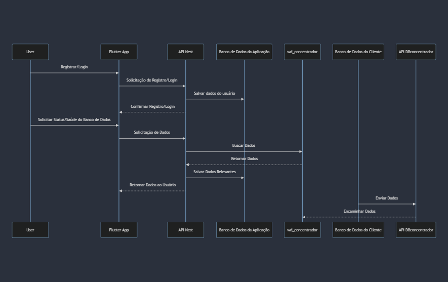
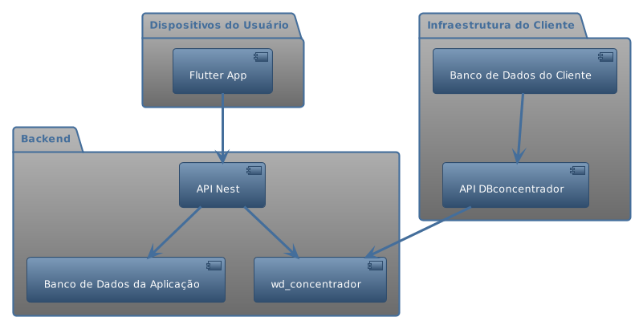
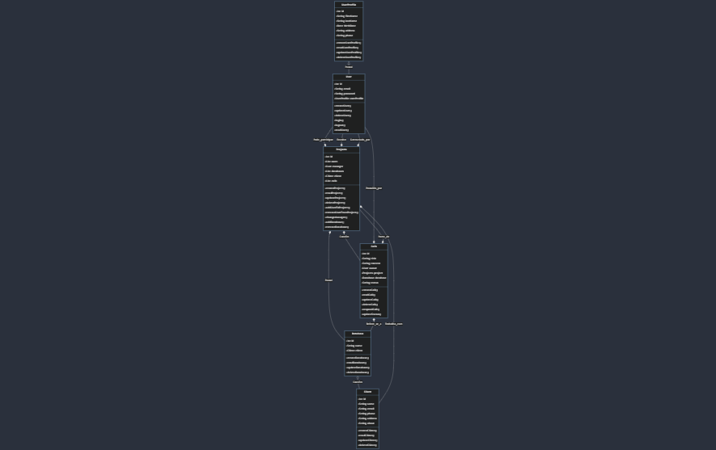

# Aplicativo de Monitoramento de Saúde de Banco de Dados

Este projeto é um aplicativo web e mobile desenvolvido utilizando Flutter para o frontend e NestJS com Prisma para o backend, utilizando um banco de dados PostgreSQL. O aplicativo atende a dois tipos de usuários: clientes e funcionários.

## Funcionalidades
### Para Clientes
* Visualizar a saúde e o status dos seus bancos de dados com várias métricas.
* Abrir chamados (tickets) de suporte para comunicação com a equipe de suporte.
* Gerar relatórios sobre o desempenho e a saúde dos bancos de dados.

### Para Funcionários 

* Responder a chamados de suporte dos clientes.
* Monitorar e analisar a saúde e o desempenho dos bancos de dados dos clientes.
* Receber alertas de possíveis problemas nos bancos de dados.

## Tecnologias Utilizadas

### Frontend: 
* Flutter (web e mobile)
### Backend: 
* NestJS
### ORM: 
* Prisma
#Banco de Dados 
*PostgreSQL

# Arquitetura
A arquitetura do aplicativo é dividida em duas partes principais:

## Frontend (MVVM)
* Flutter: Um kit de ferramentas UI para construir aplicações compiladas nativamente para mobile, web e desktop a partir de uma única base de código.

## Backend (MVC)
* NestJS: Um framework Node.js progressivo para construir aplicações server-side eficientes, confiáveis e escaláveis.
* Prisma: Um ORM de última geração que ajuda na gestão e consulta de bancos de dados.
* PostgreSQL: Um sistema de gerenciamento de banco de dados relacional open-source.

# Diagramas
## Diagrama de Sequência

## Diagrama de Componentes

## Diagrma de Classe

